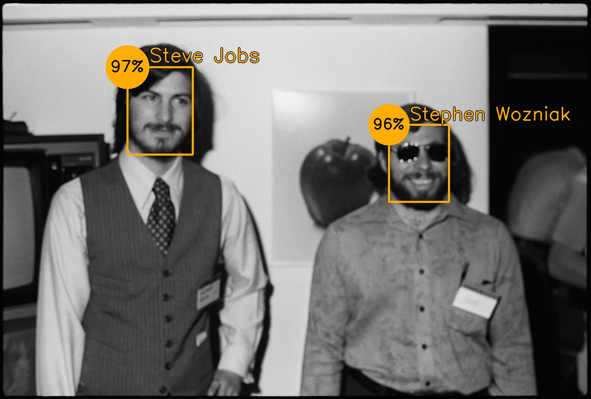
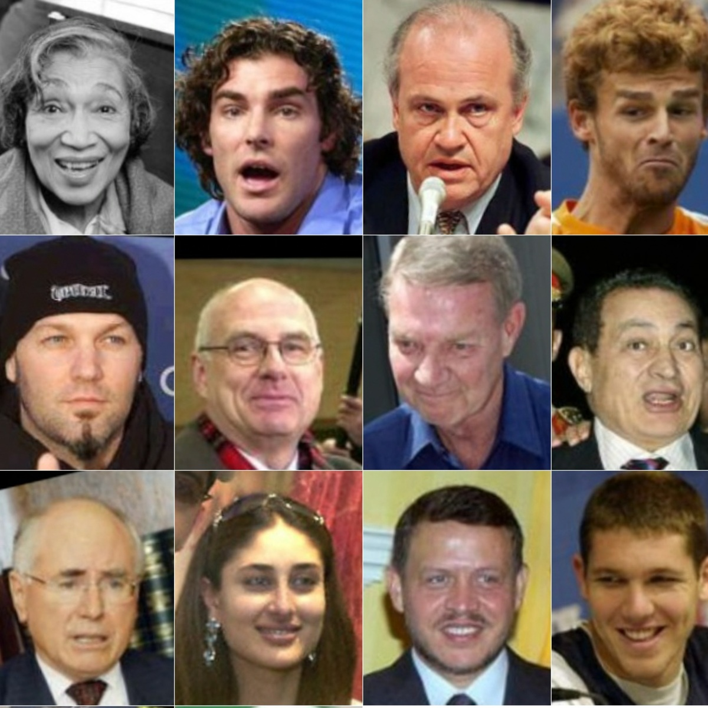
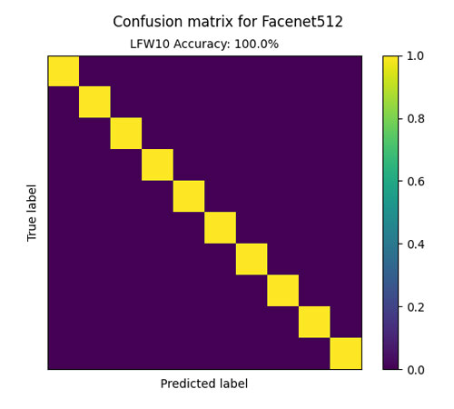
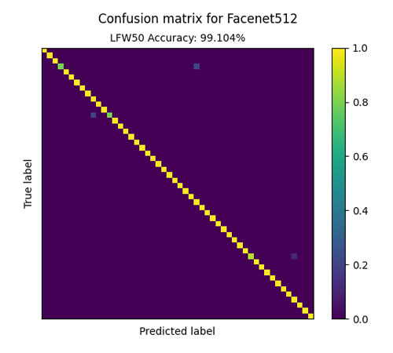

# Face Recognition With Deepface

Face recognition is considered a mature technology and modern face recognition systems are highly accurate.

They can be implemented using many Python libraries such as OpenCV and Deepface. However, these libraries do not provide a straightforward way to:

<ul>
<li>Allow the user to easily create their own datasets</li>
<li>Extract, process and recognize faces from a directory at once</li>
<li>Evaluate and compare the accuracy of multiple face recognition models</li>
</ul>

This project aims to build upon Deepface to provide a way to perform these tasks quickly and efficiently while leveraging the power of state-of-the-art face recognition models.

<p align="center">
    
</p>

## Using the program

First, clone or download the repository.

```
git clone https://github.com/ChaseLean/face-recognition-app
```

1. To detect some faces, first create a new directory of your choice eg. `my_dataset` inside `datasets`. 

2. Inside `my_dataset`, create a directory for each person inside your dataset, and add images of that person.

3. Then, place images of faces eg. `my_pic.jpg` that you want to recognize inside the directory `inputs`. 

4. Finally, inside `main/recognize_faces.py`, run the following function:

```
all_matches = recognize_faces(
    db_path="./datasets/my_dataset", 
    input_path="inputs", 
    output_path="outputs", 
    detector_backend="retinaface", 
)
```
The images will automatically be extracted with RetinaFace and converted into FaceNet512 embeddings. Then, the annotated output image(s) will appear inside the `outputs` directory. After that, the function returns `all_matches`, a Pandas dataframe containing the closest matches and coordinates for each face.

To recognize faces in a live video stream, use this function instead:

```
stream_video(
     db_path="./datasets/sample_dataset", 
     detector_backend="ssd",
)
```

By default, RetinaFace is used for its detection accuracy, while FaceNet512 is used to generate the embeddings for superior recognition accuracy (see below). SSD is recommended for the live video stream for optimum frame rate.

## Accuracy

You can evaluate the accuracy of the model by running `evaluate_model.py`, which performs 5 fold cross-validation on the specified dataset.

For demonstration, I used a subset of the [Labeled Faces in the Wild (LFW)](http://vis-www.cs.umass.edu/lfw/) dataset.

<p align="center">
    
</p>

Randomly selecting 10 individuals with >20 pictures each (total 236), and 50 individuals with >5 pictures each (total 337), here is the model accuracy:

<p float="left" align="center">
  
   
</p>

Impressive. As LFW is considered a hard dataset, this really shows the power of modern CNNs, and in particular, Google's Facenet512 in identifying faces.

In contrast, traditional methods like PCA can only achieve accuracies of around 50% in the situation above. Here is <a href="https://github.com/ChaseLean/pca-face-recognition">my implementation of it.</a>